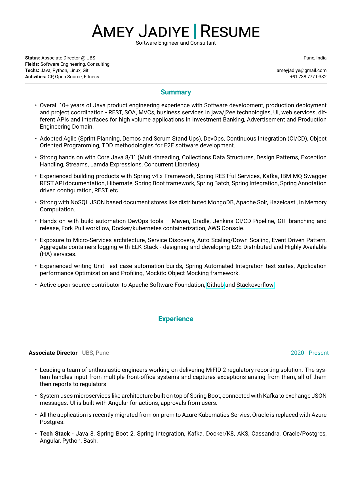

### Build using Docker

```sh
docker build -t latex .
docker run --rm -i -v "$PWD":/data latex pdflatex resume.tex
```

### Preview

```sh
pdftoppm resume.pdf preview-images/resume -png
```

### Digitally sign your pdf

```sh
amey@xps:~/work/resume/ameyjadiye-cv$ gpg --armor --detach-sig resume.pdf 
gpg: using "138008971403E215" as default secret key for signing
```

### Verify Signature

```sh
amey@xps:~/work/resume/ameyjadiye-cv$ gpg --verify resume.pdf.asc resume.pdf
gpg: Signature made Monday 18 May 2020 11:32:37 PM IST
gpg:                using RSA key A5A59EEF6B16B04E38B953A7138008971403E215
gpg: Good signature from "Amey Jadiye <ameyjadiye@gmail.com>" [ultimate]
```

